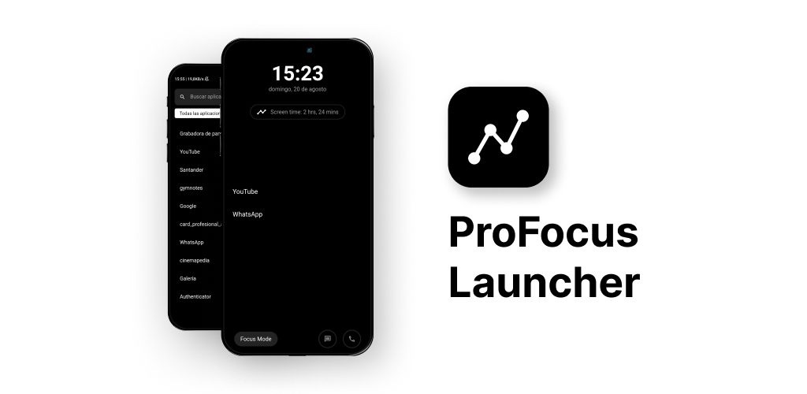

 

    
     
     
    <b>Mobile app to reduce time on the phone and enhance productivity. Android Launcher.</b>
     
     

> You can download the last release [here](https://play.google.com/store/apps/details?id=com.abiansuarez.focus_launcher).

## Why Focus Launcher?

Focus Launcher is a mobile app that helps you to reduce the time you spend on your phone and enhance your productivity. It is an Android Launcher that allows you to focus on what is important to you. It is a simple and easy-to-use app that helps you to stay focused on your tasks and avoid distractions.

## Features

- **Minimalistic Design**: Focus Launcher has a minimalistic design that helps you to focus on what is important to you.

- **Easy to Use**: Focus Launcher is easy to use. You can set it up in a few minutes and start using it right away.

- **Stay Focused**: Focus Launcher helps you to stay focused on your tasks and avoid distractions.

- **Reduce Time on Phone**: Focus Launcher helps you to reduce the time you spend on your phone and enhance your productivity.

with 💖 by <a href="https://github.com/AppZest-Labs" target="_blank">AppZest Labs</a>

